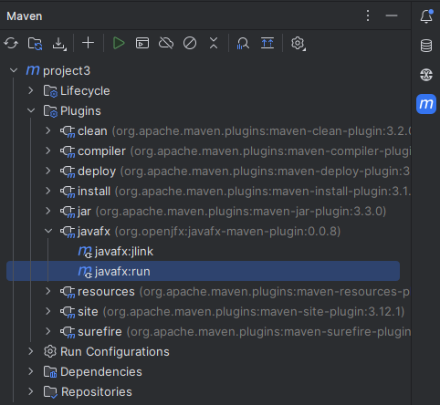
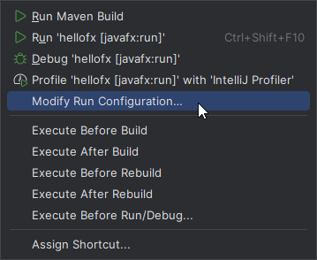

# Y1T1_CSCN72030_Project3

## Pre-requisites:
- Java Development Kit (JDK) 21 found [here](https://adoptium.net/temurin/releases/?os=windows)
- Maven (build tool) found [here](https://maven.apache.org/download.cgi)

## Running the Application:
Top Right of Intelij there is a maven icon. Maven > project3 > Plugins > javafx > javafx:run

A run config can be added to run it easier by right-clicking on it.

Now it can be run via the run button at the top.

### Useful Links:
#### Quality of Life
- Lombok is great. Don't want to have to write getters and settings? Don't! Add `@Getter` and/or `@Setter` to a class and have them auto generated at compile time! Also has other very useful annotations. [docs](https://projectlombok.org/features/)
- Apache Commons Lang 3 has a bunch of useful methods that can come in handy [javadoc](https://javadoc.io/doc/org.apache.commons/commons-lang3/3.10/overview-summary.html)
#### Tools
- [Java FX Scene Builder](https://gluonhq.com/products/scene-builder/)
- [Java FX Testing Tool](https://github.com/TestFX/TestFX/)
#### Documentation
- [Java FX Documentation](https://openjfx.io/javadoc/21/index.html)
- [Getting Started with JavaFX](https://openjfx.io/openjfx-docs/)
#### Testing
- AssertJ is about the nicest tool you will see for creating assertions. [AssertJ](https://assertj.github.io/doc/)
- JUnit 5 is the test runner we are using. [JUnit 5](https://junit.org/junit5/docs/current/user-guide/)
- Mockito is a framework that makes stubbing easy. You can mock objects and stub their return value when it's called within a method. [Mockito](https://site.mockito.org/)